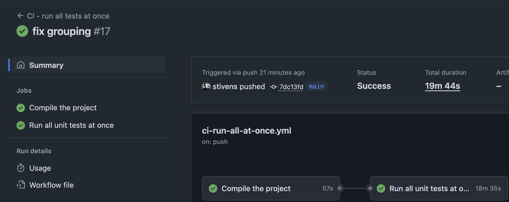
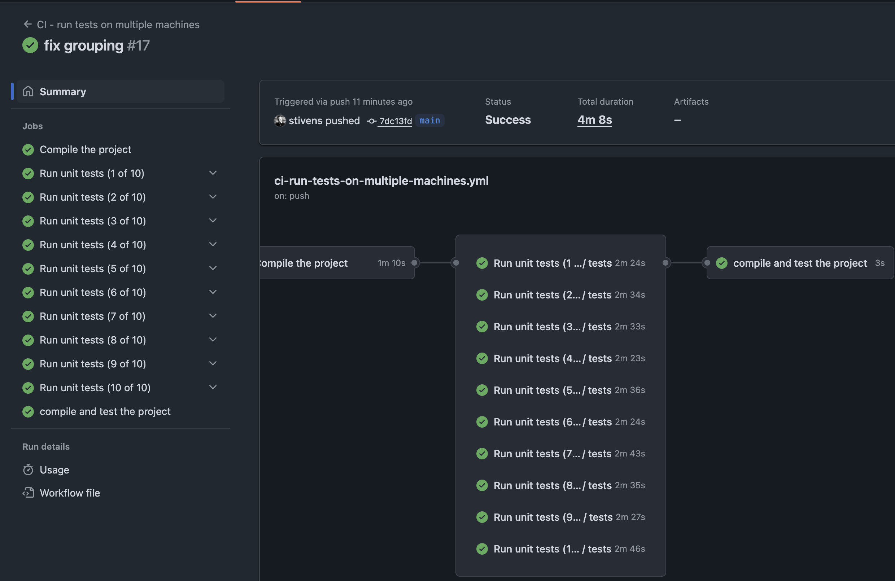

# [How to] SBT - Distribute test execution, with ease

This project demonstrates how to distribute test execution across multiple machines using SBT. Instead of running all tests sequentially\*, you can split your test suite into groups and run them in parallel, significantly reducing overall test execution time.

\* *Modern machines have multiple cores, so there will be some level of parallelism even on a single machine, but we can do better.*

## The Problem

When you have a large test suite with many time-consuming tests, running them sequentially can take a very long time.

## The Solution

This project shows how to create a custom SBT task called `parTestGroup` that:

1. **Divides tests into groups** - Splits all available tests into a specified number of groups
2. **Runs specific groups** - Allows you to run just one group of tests at a time
3. **Enables parallel execution** - Multiple machines can run different groups simultaneously

## Benefits

1. **Dramatically Faster CI/CD Pipelines** - by distributing across multiple GitHub runners
2. **Scalable Architecture** - Easy to adjust the number of groups based on test suite size and available runners
3. **Improved Developer Experience** - Faster feedback loops on pull requests and commits

## Use Cases

### Primary: CI/CD Pipeline Optimization
- **Large Test Suites** - Projects with hundreds or thousands of tests requiring long execution times
- **Integration Tests** - Long-running tests (database, API, end-to-end) that can be parallelized
- **High-Frequency Deployments** - Teams needing fast feedback on multiple daily deployments

## How It Works

The core functionality is implemented in `build.sbt` as a custom input task:

```scala
lazy val parTestGroup = inputKey[Unit]("Runs a single test group")
parTestGroup := (Def.inputTaskDyn {
  val List(groupId, numberOfGroups) = complete.DefaultParsers
    .spaceDelimited("<arg>")
    .parsed
    .map(_.toInt)

  val allTests = (Test / definedTests).value

  val numberOfTests = allTests.size
  val numberOfTestsPerGroup =
    if (numberOfTests % numberOfGroups == 0) {
      numberOfTests / numberOfGroups
    } else { (numberOfTests / numberOfGroups) + 1 }

  val groups = allTests.grouped(numberOfTestsPerGroup).toArray

  val groupToRun     = groups(groupId - 1)
  val argForTestOnly = " " + groupToRun.map(_.name).mkString(" ")

  streams.value.log.info(s"Running testOnly:$argForTestOnly")

  Def.taskDyn {
    (Test / testOnly).toTask(argForTestOnly)
  }
}).evaluated
```

## Usage

### Basic Usage

To run tests in groups, use the `parTestGroup` task with two parameters:

```bash
sbt "parTestGroup <groupId> <numGroups>"
```

- `groupId`: Which group to run (1-based index)
- `numGroups`: Total number of groups to divide tests into

### Examples

**Example 1: Split tests into 3 groups and run the first group**
```bash
sbt "parTestGroup 1 3"
```

```sbt
sbt:root> parTestGroup 1 3
[info] Running testOnly: io.github.stivens.example.suites.TestSuite5 io.github.stivens.example.suites.TestSuite7 io.github.stivens.example.suites.TestSuite2 io.github.stivens.example.suites.TestSuite6
```

**Example 2: Split tests into 3 groups and run the third group**
```bash
sbt "parTestGroup 3 3"
```

```sbt
sbt:root> parTestGroup 3 3
[info] Running testOnly: io.github.stivens.example.suites.TestSuite8 io.github.stivens.example.suites.TestSuite3
```

### Parallel Execution in CI/CD (Primary Use Case)

The main power of this approach is demonstrated in the GitHub Actions workflows that run test groups on **separate machines** simultaneously:

#### Multi-Machine Workflow (`.github/workflows/ci-run-tests-on-multiple-machines.yml`)

```yaml
jobs:
  compilation:
    name: Compile the project
    runs-on: ubuntu-latest
    # ... compilation steps

  tests-group-1:
    name: Run tests (1 of 10)
    needs: [compilation]
    uses: ./.github/workflows/run-tests-group.yml
    with:
      group_id: 1
      num_groups: 10

  tests-group-2:
    name: Run tests (2 of 10)
    needs: [compilation]
    uses: ./.github/workflows/run-tests-group.yml
    with:
      group_id: 2
      num_groups: 10

  # ... groups 3-10 running in parallel

  aggregate-all:
    name: compile and test the project
    needs: [compilation, tests-group-1, ..., tests-group-10]
    # Aggregates results from all groups
```

#### Reusable Test Group Workflow (`.github/workflows/run-tests-group.yml`)

```yaml
on:
  workflow_call:
    inputs:
      group_id:
        required: true
        type: string
      num_groups:
        required: true
        type: string

jobs:
  run_tests_group:
    runs-on: ubuntu-latest
    steps:
    - uses: actions/checkout@v4
    - uses: ./.github/actions/setup-scala
    - uses: ./.github/actions/restore-compilation-cache
    - name: Run tests
      run: sbt 'parTestGroup ${{ inputs.group_id }} ${{ inputs.num_groups }}'
```

## Execution Time Comparison

### Demo Test Suite

This project includes some mock test suites, each containing a test that busy waits to simulate long-running tests.

### Results

- **Single-machine CI** (`.github/workflows/ci-run-all-at-once.yml`): ~20 minutes to see the final result
- **Parallel CI** (`.github/workflows/ci-run-tests-on-multiple-machines.yml`): finished in ~4 minutes





## Getting Started

### Try the Demo

1. **Clone this repository**
   ```bash
   git clone git@github.com:stivens/sbt-how-to-distribute-test-execution-easily.git
   cd sbt-how-to-distribute-test-execution-easily
   ```

2. **Run a single test group locally**
   ```bash
   sbt "parTestGroup 1 2"
   ```

### Adapt to Your Project

1. **Copy the SBT task** - Add the `parTestGroup` task definition to your `build.sbt`
2. **Set up GitHub Actions** - Copy and adapt the workflows from `.github/workflows/`
3. **Customize group count** - Adjust `num_groups` based on your test suite size and available runners
4. **Configure caching** - Adapt the compilation caching actions for your project structure

